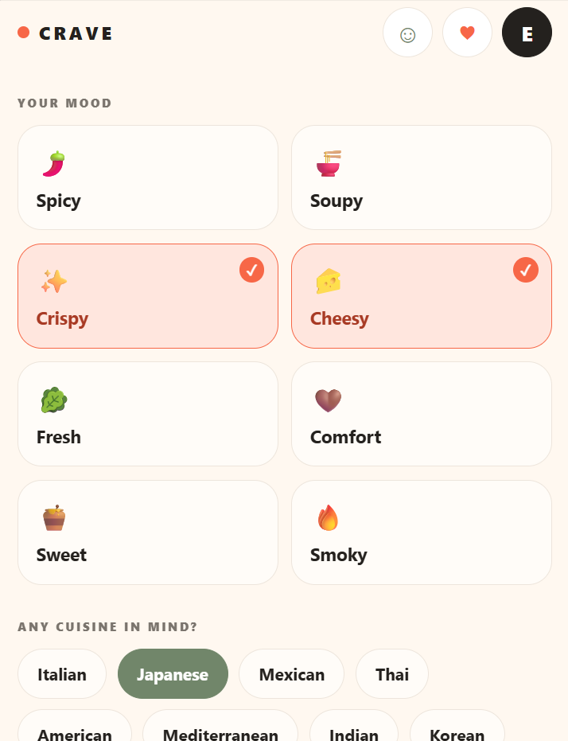
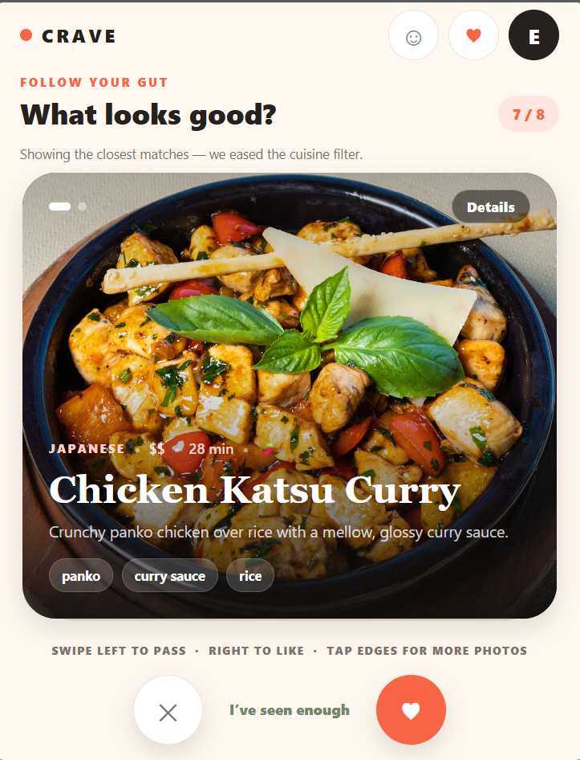
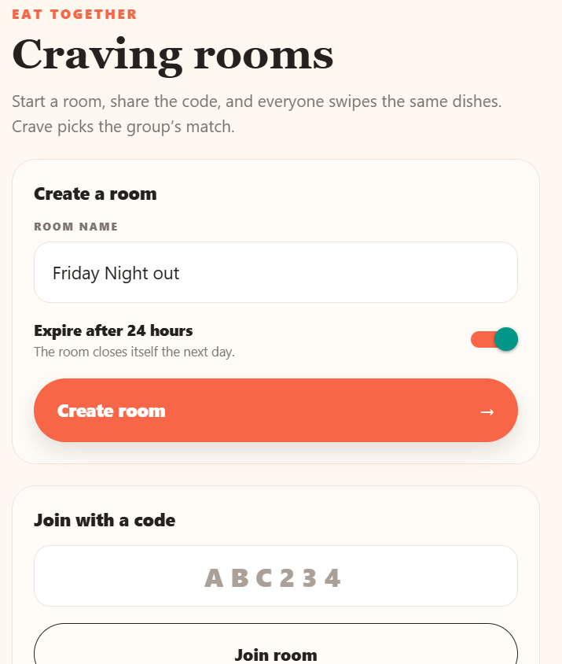
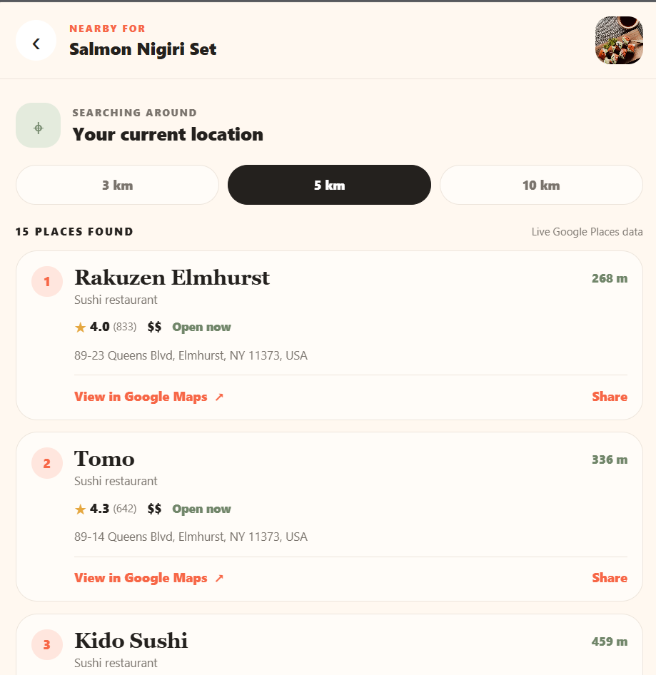
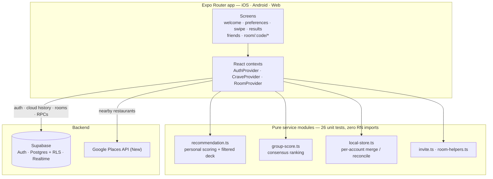

<div align="center">

# 🍽️ Crave

### Kill the *“I don’t know, what do you feel like?”* dinner spiral — swipe on it instead.

Crave turns an endless group chat into a decision. Swipe through a photo-first deck and a
recommendation engine learns your taste from **every like and pass**. Can’t agree with
friends? Open a **craving room** — everyone swipes the same dishes on their own phone and
Crave surfaces the one pick you’ll *all* be happy with, then finds it near you.

<br/>

[](https://kay116.github.io/Crave/)
&nbsp;
[](#-screenshots)

<br/>


<sub>Solo portfolio build, focused on the hard parts: **offline-correct multi-account sync**, **RLS-enforced realtime multiplayer**, and a **pure, unit-tested recommendation core**.</sub>

[Live demo](#-live-demo) · [Screenshots](#-screenshots) · [Why it’s interesting](#-engineering-highlights) · [Architecture](#-architecture) · [Quick start](#-quick-start)

</div>

---

## ▶ Live demo

> ### [🍽️ &nbsp;Open Crave in your browser →](https://kay116.github.io/Crave/)
>
> No install. Tap **“Continue as guest”** for discovery + swiping instantly, or make a
> throwaway account to try cross-device sync and craving rooms. On desktop, shrink the
> window to phone width for the intended layout.

Auto-deployed from `version-4` by [`.github/workflows/deploy-web.yml`](.github/workflows/deploy-web.yml)
(`expo export` → GitHub Pages). **One-time repo setup:**

1. **Settings → Pages → Build and deployment → Source: “GitHub Actions”.**
2. **Settings → Secrets and variables → Actions → New repository secret** — add
   `EXPO_PUBLIC_SUPABASE_URL` and `EXPO_PUBLIC_SUPABASE_PUBLISHABLE_KEY`
   (add `EXPO_PUBLIC_GOOGLE_PLACES_API_KEY` too if you want the nearby search;
   restrict that key to the Pages domain). *With no secrets the demo still runs in
   guest-only mode.*
3. **Supabase → Authentication → URL Configuration → Redirect URLs** — add
   `https://kay116.github.io/Crave/**` so email links work.
4. Push, or run the workflow from the **Actions** tab. Live in ~2 minutes.

Prefer Netlify/Vercel? `npx expo export --platform web` → drop `dist/` on
[app.netlify.com/drop](https://app.netlify.com/drop). Those serve from the root, so
unset `EXPO_BASE_URL`.

---

## 📸 Screenshots

<table>
  <tr>
    <td width="50%"></td>
    <td width="50%"></td>
  </tr>
  <tr>
    <td align="center"><b>Set the vibe</b> — moods, cuisines, and optional filters</td>
    <td align="center"><b>Swipe the deck</b> — tap the edges for more photos; over-strict filters relax and say so</td>
  </tr>
  <tr>
    <td width="50%"></td>
    <td width="50%"></td>
  </tr>
  <tr>
    <td align="center"><b>Decide as a group</b> — share a code, everyone swipes the same deck</td>
    <td align="center"><b>Find it near you</b> — live Google Places results for the pick</td>
  </tr>
</table>

<sub>Add your PNGs to <a href="docs/screenshots/"><code>docs/screenshots/</code></a> — <a href="docs/screenshots/README.md">guide here</a>. A short <code>demo.gif</code> works even better.</sub>

---

## ✨ Engineering highlights

These are the parts that were actually hard — and where the interesting code lives.

- **Account-isolated, local-first storage.** Every identity (guest, and each signed-in
  user) gets its own storage key, so one account’s history can never be read into — or
  uploaded from — another on a shared device. Guest history migrates into an account
  **exactly once**. A dish un-liked while offline **stays un-liked** after the next
  sync (tombstones + “cloud-authoritative after pending ops”, not a blind union).

- **RLS-enforced multiplayer.** Rooms are readable only by their members. Joining is a
  Postgres `SECURITY DEFINER` function keyed on a short invite code, so rooms **can’t be
  enumerated by ID**. Individual swipe choices never leave the database — the results
  screen gets **aggregate counts only**, via a dedicated RPC.

- **A pure, unit-tested core.** Scoring, filtering, deck selection, per-account merge,
  and like-reconciliation live in dependency-free modules with **26 `node:test`
  tests**. The React Native app is a thin shell over them.

- **Consensus group algorithm.** Ranks dishes by _unanimous likes → liked by the most
  people → personalised tie-break → fewest passes_, and explains itself
  (“3 of 4 friends liked this”).

- **Realtime that degrades gracefully.** Supabase Realtime drives live room updates;
  the client **re-fetches on every event** (so duplicate events and reconnects are
  harmless) and runs a **polling fallback**, so a manual refresh always converges.

- **Recency-weighted personalisation.** Likes/passes decay on a 60-day half-life;
  the current session’s swipes are weighted above old history; over-strict filters
  relax lowest-priority-first instead of returning an empty deck.

---

## 🧩 Features

| | |
| --- | --- |
| **Solo discovery** | Mood / cuisine / texture / meal / protein / spice / price / dietary filters (or “Surprise me”), a swipeable photo-first deck, a “why this matched” explanation, and a nearby-restaurant search. |
| **Craving rooms** | Create a room → share a 6-char code or link → everyone swipes the same deck → Crave computes the group’s match. Live join / completion / result states, 24-hour expiry, host-closes-room. |
| **Accounts** | Supabase email/password with confirmation, password reset, and a full guest mode. History syncs across devices; guests stay fully local. |
| **48-dish catalog** | 12 cuisines, 2–3 photos per dish with alt text and attribution, `expo-image` caching + fallback, next-card prefetch. |
| **Native sharing** | OS share sheet on iOS/Android; Web Share API with clipboard fallback on web. Invite links only when a real public URL is configured — never a broken `localhost` link. |

---

## 🛠 Tech stack

**Expo SDK 57** · React Native 0.86 · React 19 · **TypeScript (strict)** · `expo-router` (typed routes) ·
**Supabase** (Auth · Postgres · Row Level Security · Realtime) · **Google Places API (New)** ·
`expo-image` · React Native Reanimated · `node:test` + `tsx`

---

## 🏗 Architecture



- **Screens** are thin. Anything testable is pushed into `src/services/*` as a pure
  function; those modules have **no React / RN / async imports** so they run under
  plain Node.
- **Contexts** own side effects: `AuthProvider` (session), `CraveProvider` (local
  state, learning model, migration, cloud sync), `RoomProvider` (room load + realtime
  + polling).
- **Supabase** does the multi-user work: RLS policies + `SECURITY DEFINER` RPCs for
  create/join/results; the app only ever holds the publishable (anon) key.

---

## 🚀 Quick start

```bash
git clone https://github.com/Kay116/Crave.git
cd Crave
npm install
cp .env.example .env.local        # then fill in the values below
npm start                         # press w for web, or a / i for a device
```

**`.env.local`**

```dotenv
EXPO_PUBLIC_SUPABASE_URL=https://<project>.supabase.co
EXPO_PUBLIC_SUPABASE_PUBLISHABLE_KEY=<publishable-anon-key>
EXPO_PUBLIC_GOOGLE_PLACES_API_KEY=<places-api-new-key>   # optional; only the nearby search needs it
EXPO_PUBLIC_APP_URL=https://your-deploy.example.com      # optional; makes room invite links clickable
```

**Supabase (one-time):** open the SQL Editor and run
[`supabase/schema.sql`](supabase/schema.sql) on a fresh project, or
[`supabase/migrations/0001_v4_craving_rooms.sql`](supabase/migrations/0001_v4_craving_rooms.sql)
to add the room tables to an existing one. Both are idempotent. Then add
`http://localhost:8081/**` and your deploy URL to
**Authentication → URL Configuration → Redirect URLs** so email links work.

**Deploy the web build:** see [Live demo](#-live-demo) above — `expo export` →
static `dist/` → any host.

---

## ✅ Tests & checks

```bash
npm run verify      # tsc (strict) + test typecheck + expo lint + unit tests
npm test            # just the 26 unit tests (node:test via tsx)
npx expo-doctor
npx expo export --platform web --clear
```

The suite (`src/services/__tests__/`) covers:

| Area | Cases |
| --- | --- |
| Personal scoring | mood/cuisine weighting · session-vs-history · attribute filters |
| Filtered deck | over-strict filters relax lowest-priority-first · dietary respected · “Surprise me” |
| Group scoring | unanimous · split vote · partial completion · no-likes · personal tie-break |
| Rooms | invite-code validation · expiry / phase transitions |
| Sync & isolation | guest→account merge (once) · account-key isolation · offline like-removal stays removed |
| Sharing | invite messages never leak a `localhost` link |

---

<details>
<summary><b>Supabase schema, RLS & realtime (details)</b></summary>

**Tables** (`supabase/schema.sql`): `profiles`-free — auth is Supabase Auth only.
`preference_sessions`, `swipe_events`, `saved_dishes` (V3) + `craving_rooms`,
`room_members`, `room_swipes` (V4). Every table has RLS enabled.

**Room policies**

- `craving_rooms` — `select` requires membership; `update` requires `created_by = auth.uid()`.
- `room_members` — a member can see co-members; only the creator can self-insert (everyone
  else joins via the RPC); update/delete limited to your own row.
- `room_swipes` — you can only read/insert/update **your own** rows.

**Functions** (`SECURITY DEFINER`, `search_path = public`)

- `generate_room_code()` — secure random 6 chars, unambiguous alphabet (no `0/O/1/I/L`), retries on collision.
- `create_craving_room(...)` — creates the room + adds the creator as member atomically.
- `join_craving_room(code, name)` — the **only** way to join a room you didn’t create; rejects closed / expired / unknown codes.
- `room_results(room_id)` — returns per-dish `likes / passes / voters` **counts**, never who voted.

**Realtime** — the migration adds the three room tables to the `supabase_realtime`
publication. `RoomProvider` subscribes and re-fetches on each event; a 4–30 s
polling loop (cadence by room phase) is the fallback.

</details>

<details>
<summary><b>Data model (details)</b></summary>

```ts
type DishImage = { url: string; alt: string; sourceName?: string; photographer?: string };

type Dish = {
  id: string; name: string; cuisine: Cuisine; description: string;
  images: DishImage[];                       // 2–3 per dish
  moods: Mood[]; textures: string[]; mealTypes: string[];
  dietaryTags: string[]; proteins: string[]; // discovery metadata — not allergy advice
  spiceLevel: number; price: number; time: number;
  searchTerms: string[];                     // Google Places queries
  image: string; tags: string[];             // back-compat, always populated
};
```

`craving_rooms(id, code, name, created_by, status, dish_ids, selected_moods,
selected_cuisines, created_at, expires_at)` — no location data is ever stored on a room.

</details>

<details>
<summary><b>Image sourcing</b></summary>

Dish photos are hot-linked from the Unsplash CDN under the
[Unsplash License](https://unsplash.com/license); `sourceName`/`photographer` are kept
for attribution (never fabricated). Swap in owned or licensed assets before any real
launch — the `DishImage` shape stays the same. All 100 image URLs were checked
(200/302, no duplicates).

</details>

<details>
<summary><b>Known limitations</b></summary>

- `expo-doctor` flags a few Expo packages a patch behind the SDK’s preferred versions
  (pre-existing; bump with `npx expo install --check` when ready).
- The group personalised tie-break uses the **viewer’s** own history (other members’
  histories aren’t shared, by design), so ordering of tied dishes can differ per viewer.
- Guest auto-migration is **once per device** — a second guest session after a migration
  won’t auto-merge into a later account (that account’s cloud history still loads).
- A few secondary dish photos are cuisine-appropriate stock rather than the exact plate.
- `EXPO_PUBLIC_*` values are bundled into the client by design (publishable keys only) —
  proxy the Google Places call before a public production release.

</details>

---

## 📁 Repo tour

| Path | What |
| --- | --- |
| `src/app/` | Screens (`expo-router` file routes) — welcome, preferences, swipe, results, likes, history, nearby, auth, account, **friends**, **room/[code]/**\* |
| `src/context/` | `auth-context`, `crave-context`, `room-context` |
| `src/services/` | Pure logic: `recommendation`, `group-score`, `local-store`, `invite`, `room-helpers`, `sharing` · plus `rooms`, `cloud-history`, `places`, `supabase` |
| `src/services/__tests__/` | 26 `node:test` unit tests |
| `src/components/` | `swipe-card` (multi-photo gesture card), `dish-details` (carousel modal), `smart-image` (cached + fallback) |
| `supabase/` | `schema.sql` + `migrations/0001_v4_craving_rooms.sql` |

---

## 📄 License

MIT — see [`LICENSE`](LICENSE). _(Update the copyright line to your name.)_
